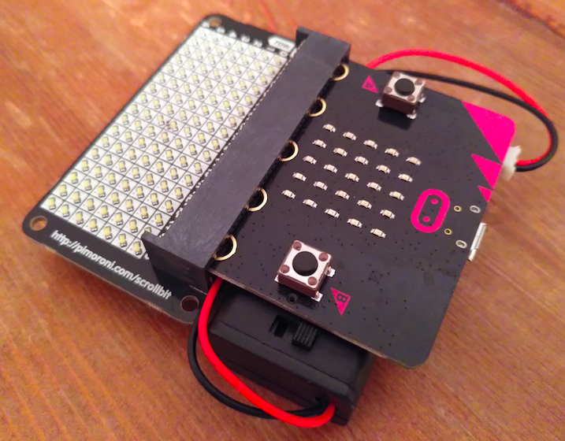

# Introduction

You will need a [**scroll:bit**](https://coolcomponents.co.uk/products/scroll-bit) (matrix of LEDs) and the [**micro:bit**](https://coolcomponents.co.uk/products/bbc-micro-bit-official-board-only) (a microcontroller).  If you have a  [battery pack](https://coolcomponents.co.uk/collections/micro-bit/products/battery-holder-with-switch-and-lid-2x-aaa-with-2-pin-jst-connector-for-bbc-micro-bit) you can blutack it to the back:

Note the micro:bit needs to be pushed (quite hard) all the way into the connector so none of the "teeth" are showing.  The power switch is sticking out the side on the battery box and represents the peak of design sophistication.

# Installation & Setup (on Windows)

## Install Python 3

* [Download](https://www.python.org/downloads/windows/) the current v3.x installer: 
* Run the installer, being sure to tick "Add Python 3.x to PATH"
* Click *Install Now* for a default installation which includes the `pip` program needed later.

## Install Visual Studio Code
This is a source code/text editor and  provides a terminal for running commands.

* Download and install from https://code.visualstudio.com/download
* Once installed open the VS Code application and from the menu bar click *Terminal* -> *New Terminal*.
* In the terminal type `python --version`, it should say Python 3.8, or similar.

At various points VS Code might offer to install plug-ins which it thinks will be helpful, based on what it can see you doing.  You don't have to install them, and sometimes they will be stupid, but they shouldn't  do any harm.  They do things like colour the code nicely or show syntax errors.

## Install Python tools for micro:bit
* In the terminal type `pip install uflash microfs` to install two important tools: [uflash](https://pypi.org/project/uflash/) & [microfs](https://pypi.org/project/microfs/).  You may get some warnings about pip not being the latest version - shouldn't matter.
* Plug the micro:bit into the computer using the micro USB port.  It will spring into life and also appear as a  flash drive, but we can ignore that.  By the way, you don't need to eject it or power it down - you just yank it out, even when it's running a program.
* Type `ufs ls` in the termianl.  This command should connect to the micro:bit and list the files currenty loaded into it.

# Install Code on micro:bit

## Add Source Code Folder
* Copy the source code (python files) to a folder on your computer.
* In VSCode select *Menu* -> *Add Folder to Workspace...*, highlight the source code folder and press *Add*.  The folder will be added to file explorer on the left. You can view and edit the files by double clicking on them.

## Open a Terminal
* Now the project folder is set up, if you open a terminal (by selecting *Terminal* in the menu bar then *New Terminal*) it will set the terminal to be "in" the project folder.
* Type `ls` in the terminal and press return.  It should list the files in the project folder.

## Installation
* Start by wiping the micro:bit memory completely.  Type the command `uflash` in the terminal and press return.  This will connect to the micro:bit, erase everything on it, and load a fresh version of the MicroPython interpreter.  It's like formatting the hard drive and installing an operating system.
* We need to put three 'helper' bits of code on the micro:bit.  Type each of the `ufs` commands given below into the terminal and press enter, one after another. The files will be uploaded from the folder you loaded into VSCode.
  * `ufs put scrollbit.py`.  This file is a cut down version of the [official scrollbit code](https://github.com/pimoroni/micropython-scrollbit/blob/master/library/scrollbit.source.py), to save space so we can fit more of our own code on.  Official docs for the full library are [here](https://github.com/pimoroni/micropython-scrollbit).
  * `ufs put medal.py`.  This file has the code which draws the scrolling the 'medal' image when you win.  Rowan drew it on graph paper then worked out the pixel numbers.
  * `ufs put operations.py`.  This contains code to help with things like turning the snake clockwise or anticlockwise, and detecting if the snake has hit the edge.
* The main program is loaded with with `ufs put main.py`.  Note that the main program must always be called `main.py` in order to be detected and run.
* If the micro:bit hasn't automatically started running press the reset button on the back.

# Edit Code
Once you know the game works, you can try editing the code.  Here we'll just make a simple change to the `main.py` file and upload it.  If you made changes to any of the other files you'd need to upload them too.

* In VS Code, open and comment out the line near the end of `main.py` which says `sleep(100)`.  Do this by putting the cursor on the correct line then pressing `Ctrl /` or just typing a `#` at the start of the line.
* Save the file with `Ctrl s`.
* Go to the terminal and upload the modified file to the plugged in micro:bit with the command `ufs put main.py`.

If at any point there is an error in the code, the micro:bit will scroll a message on it's small red LED display, hopefully telling you which line it thinks the problem relates to.

Note that there is very little memory on the micro:bit, and the code is pretty close to the limit of the size that it can handle without error.  So you won't be able to add much more code without deleting some of what's already there.

# Onward

* Official [tutorials & API](https://microbit-micropython.readthedocs.io/en/latest/tutorials/hello.html) docs including the different commands you can use on the micro:bit.
* Go [shopping](https://coolcomponents.co.uk/collections/micro-bit)
* Discover [awesome](https://github.com/carlosperate/awesome-microbit)

